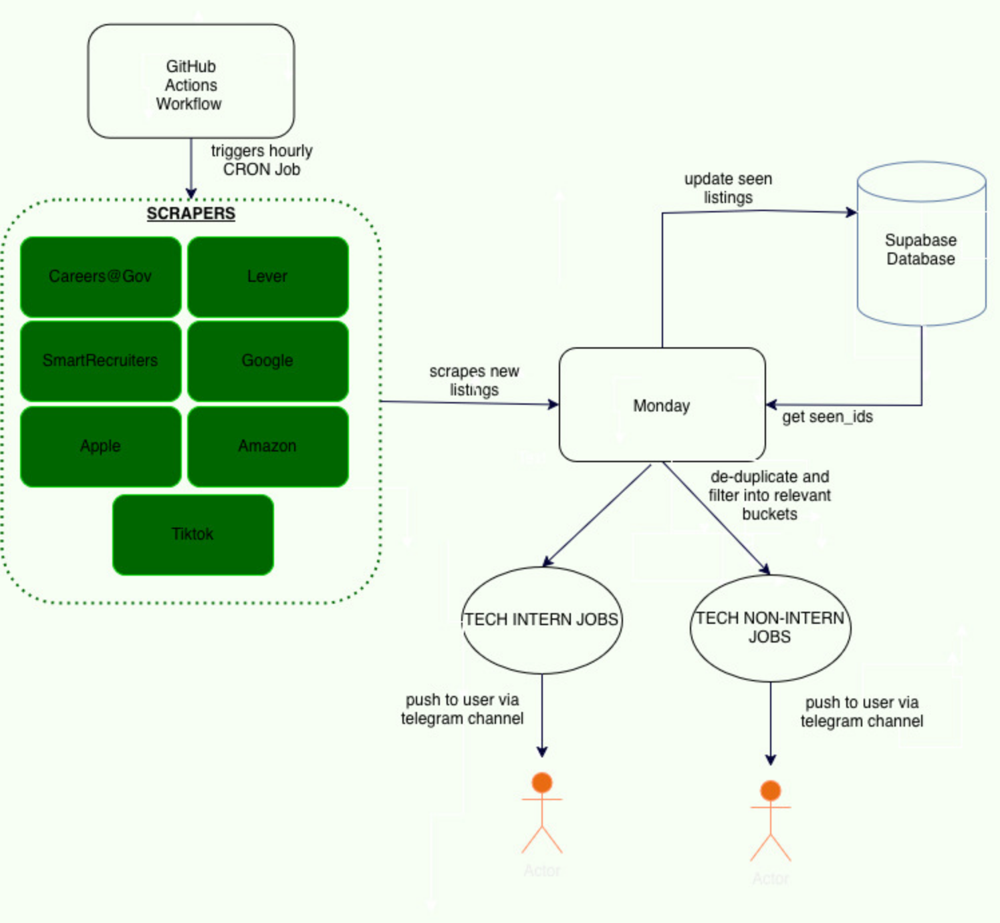

# monday 📅

Monday is a **pull only telegram-bot personal management system**. 

This project was inspired by the realisation that as a computing student, the problems cardinal to our daily lives have each already been solved, but the answers are fragmented. Canvas for our academic updates and deadlines, LinkedIn for job updates, Outlook for mail, Apple Calendar for reminders and the list goes on.

Monday aims to provide users with these fragmented data, without needing the overhead of commands from the user or the need to open another app. They are fed through the users through a **pull only** telegram bot. 

### 🚧 Current State

Currently, the live job updates has been updated through a general public telegram channels listed below, while the remaining features are in development

### 💬 Telegram Channel Links
- [SG TECH GRAD POSTINGS](https://t.me/+MewlVkBO5hs3YzU1)
- [SG TECH INTERN POSTINGS](https://t.me/+OmIAIHXeX1VlNTVl)

### 🏗️ Current Architecture

